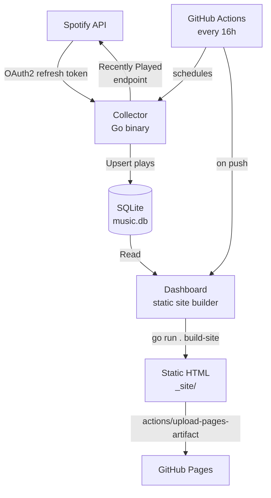

# Muse Journal

[](https://github.com/pjpangilinan/muse-journ/actions/workflows/ci.yml)
[](https://github.com/pjpangilinan/muse-journ/actions/workflows/collector.yml)
[](https://github.com/pjpangilinan/muse-journ/actions/workflows/pages.yml)
[](https://go.dev)
[](LICENSE)

Automated personal Spotify listening history archive. Self-hosted, permanent, searchable.

Every 12 and 8 PM, fetches recently played tracks from Spotify, stores them in SQLite, and publishes a static dashboard to GitHub Pages.

## Architecture



## Quick Start

### 1. Set up Spotify

Create an app at [developer.spotify.com/dashboard](https://developer.spotify.com/dashboard).

Add redirect URI: `http://127.0.0.1:9090/callback`

### 2. Get refresh token

```bash
SPOTIFY_CLIENT_ID=xxx SPOTIFY_CLIENT_SECRET=yyy go run ./cmd/auth-server/
```

Open the URL, authorize, save the `refresh_token` from the JSON response.

### 3. Test locally

```bash
# Collect your recent plays
SPOTIFY_CLIENT_ID=xxx SPOTIFY_CLIENT_SECRET=yyy SPOTIFY_REFRESH_TOKEN=zzz go run . collector

# View dashboard
go run . dashboard
# Open http://127.0.0.1:9090
```

### 4. Deploy to GitHub Pages

```bash
# Push to GitHub (private repo)
git remote add origin git@github.com:you/muse-journ.git
git push -u origin main
```

Set repository secrets:
- `Settings` → `Secrets and variables` → `Actions`
- `SPOTIFY_CLIENT_ID`
- `SPOTIFY_CLIENT_SECRET`
- `SPOTIFY_REFRESH_TOKEN`

Enable Pages: `Settings` → `Pages` → Source: `GitHub Actions`

## Commands

| Command | Description |
|---------|-------------|
| `go run . collector` | Fetch recently played from Spotify, store in SQLite |
| `go run . dashboard` | Start web dashboard server (port 9090) |
| `go run . build-site` | Generate static HTML to `_site/` for GitHub Pages |
| `go run ./cmd/auth-server/` | OAuth authorization flow to get refresh token |

## Project Structure

```
├── .github/workflows/
│   ├── collector.yml    # Runs every 16h: fetch plays, commit DB
│   ├── ci.yml           # On push: format, vet, build, test
│   └── pages.yml        # On push: build static site, deploy to Pages
├── cmd/
│   ├── collector/          # Collector binary
│   ├── dashboard/          # Dashboard server binary
│   │   └── templates/
│   │       └── index.html  # Material 3 dark dashboard template
│   └── auth-server/        # OAuth setup binary
├── internal/
│   ├── analytics/          # Daily/monthly stats engine
│   ├── config/             # Environment-based config
│   ├── database/           # SQLite layer with migrations
│   ├── reports/            # Markdown report generator
│   └── spotify/            # HTTP client, OAuth, collector
├── migrations/             # Raw SQL migrations (reference)
├── _site/                  # Generated static site output
├── music.db                # SQLite database (gitignored)
├── main.go                 # CLI entry point
└── go.mod
```

## Database

```
play_events ──> tracks ──> albums
    │               │
    │               └──> track_artists ──> artists
    │
    └──> Unique index on (track_id, played_at) prevents duplicates
```

SQLite with WAL mode. Auto-migrated on every run. ~7.5KB/year growth rate.

## Design

- **Theme:** Material 3 dark (matching `sample.html`)
- **Fonts:** Geist (headings), Inter (body), JetBrains Mono (labels)
- **Icons:** Material Symbols
- **Charts:** N/A (planned: Apache ECharts)

## Security

- Secrets never committed. OAuth2 refresh token stored as GitHub Secret.
- Dashboard binds to all interfaces by default. Restrict: `BIND_ADDR=127.0.0.1:9090`
- SQLite database gitignored. Listening history stays local.
- Minimal GitHub Actions permissions: `contents: write` for collector.

## License

MIT
